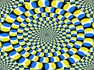
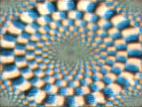
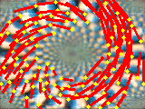

# PredNet in chainer

Kenta Tanaka, Eiji Watanabe, Lana Sinapayen 2020

## Overview

This code is the chainer implementation of [PredNet](http://arxiv.org/abs/1605.08104) Lotter, William, Gabriel Kreiman, and David Cox. "Deep Predictive Coding Networks for Video Prediction and Unsupervised Learning." arXiv preprint arXiv:1605.08104 (2016)."

The network learns a still image sequence generated from a video by a deep learning algorithm, and generates predicted frames.

## Quick start
Open `running_chainer.ipynb` in Codalab.  
Upload video frames by drag-and-drop in your codalab instance.

## Test environments

The code has been tested and runs on following setups:

1.
OS: Ubuntu 16.04  
Python: 2.7  
GPU: Nvidia GTX1080ti  
chainer==5.30  

2.
Codalab Python 3 + GPU

3.
OS: Ubuntu 16.04.5LTS
Python: 2.7.12
GPU: Nvidia GTX1080ti
chainer==6.7.0

## Requirements

tensorboard-chainer  
opencv  
pillow  
matplotlib  
scipy  
python-opencv  
setuptools  
numpy  
cupy  
net  
cv2  
setuptools  
tensorboard-chainer

GPU driver, CUDA Toolkit and cudnn

## Preparing the data

Put the target movie file (mp4) in "data" folder.
Execute the following command to generate still images from the movie.

`python utilities/extract_frames.py path/to/mp4/video -d input_images`

To change the width of the image, use the -w option.

`python generate_image.py data/YOUR_VIDEO -d data -w 160`

The height can also be specified with -g option.

`python generate_image.py data/YOUR_VIDEO -d data -w 160 -g 120`

If no option is specified, the width is fixed to 160 and the height is fixed to 120.

List files "train_list.txt" and "test_list.txt" describing the list of files used for training and testing are saved.
By default, the latter half of the video will be the test data.

## Examples of training and testing commands

see `running_chainer.ipynb` .

Example with [test images](https://figshare.com/articles/Test_data/5483680), using this [model](https://figshare.com/articles/Sample_Weight_Model_Front_Psychol_15_March_2018_/11931222) trained on [FPSI dataset](https://figshare.com/articles/Training_data/5483668). Output 10 predicitons of the rotating snake illusion on gpu

`python chainer_prednet/PredNet/call_prednet.py --images input_images --initmodel fpsi_500000_20v.model --input_len 10 --test --g 0`

Example of training on your own data:

`chainer_prednet/PredNet/call_prednet.py --images input_images --g 0 --save 10000 --period 1000000` 

This will train the network on your specified input for 1000000 steps and save `[step].model` files.

### Optical flow

The optical flow module allows you to visualise predicted motion.
For example to detect visual illusions, perform extended prediction on a static input image and take the optical flow between two extended predictions or even between a regular prediction and an extended prediction.
See `running_prednet.ipynb` for how to run the following example: a. Rotating Snakes illusion as input image, b. extended prediction, c. optical flow (magnified 60x)

## References

https://github.com/neka-nat/ by Tanaka

https://coxlab.github.io/prednet/ Original PredNet

https://github.com/quadjr/PredNet Implemented by chainer

